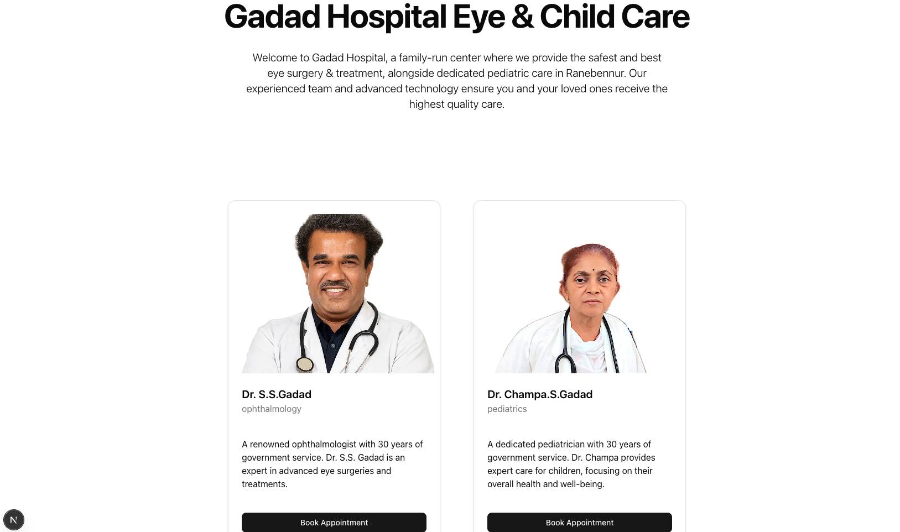
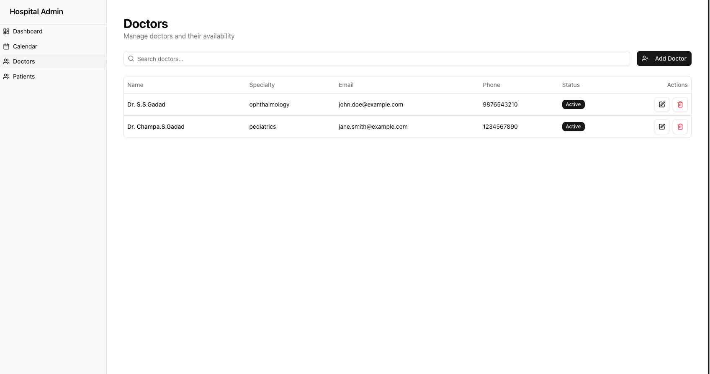
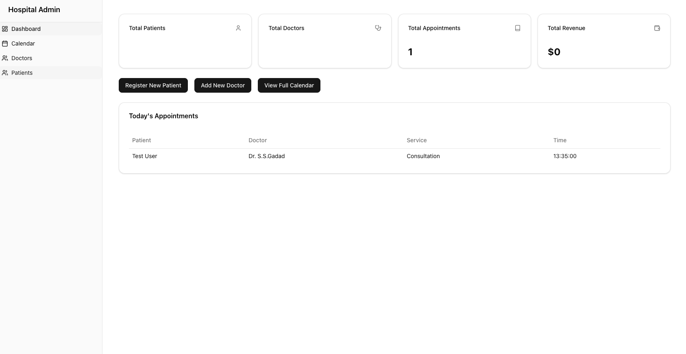
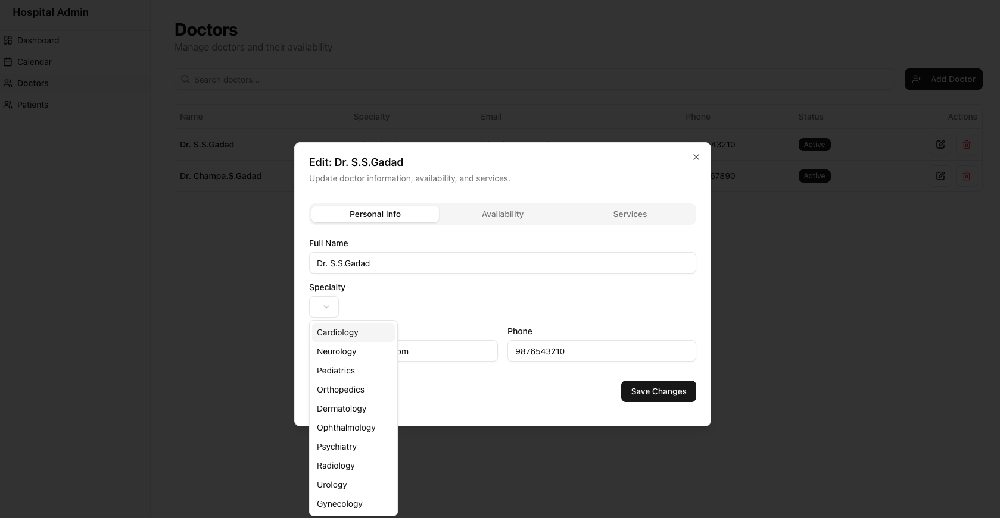
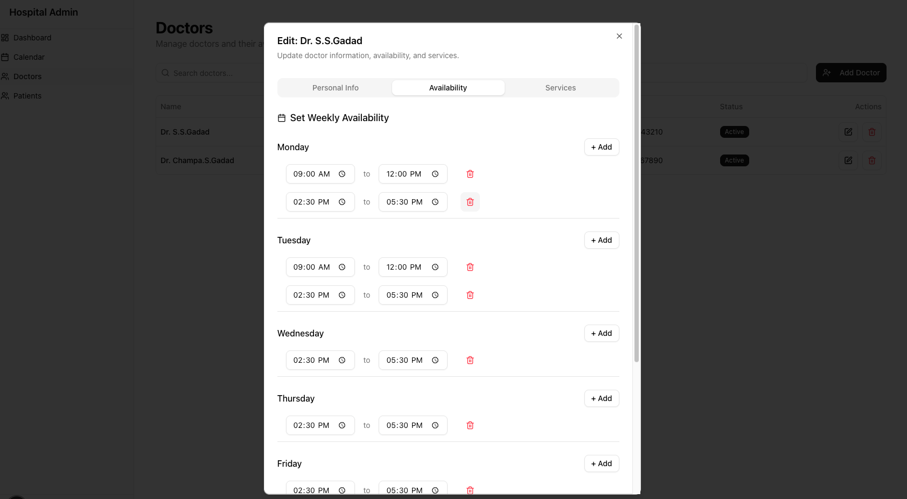
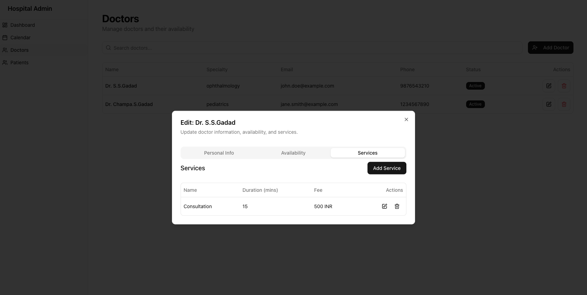

# Multi-Tenant Hospital Management System

This is a multi-tenant hospital management application built with Next.js. It provides a robust platform for hospitals to efficiently manage doctors, patients, appointments, and medical records. Key features include streamlined online booking, dedicated landing pages for each hospital tenant, and a comprehensive administrative dashboard.

## Application Screenshots









## Key Features

- **Multi-Tenancy:** Supports multiple hospital instances, each with its own data and customizable landing page.
- **Online Booking:** Patients can easily book appointments with doctors through a user-friendly interface.
- **Doctor Management:** Features for managing doctor profiles, schedules, and services.
- **Appointment Scheduling:** Efficient system for scheduling and tracking appointments.
- **Administrative Dashboard:** A powerful admin interface for overall system management and insights.

## Getting Started

First, run the development server:

```bash
npm run dev
# or
yarn dev
# or
pnpm dev
# or
bun dev
```

**Important Note for Development:**

Due to the multi-tenancy architecture and subdomain routing, you must access the development server using `http://gadadhospital.lvh.me:3000/` instead of `http://localhost:3000/`. Subdomains do not resolve correctly on `localhost`.

Open [http://gadadhospital.lvh.me:3000/](http://gadadhospital.lvh.me:3000/) with your browser to see the result.
